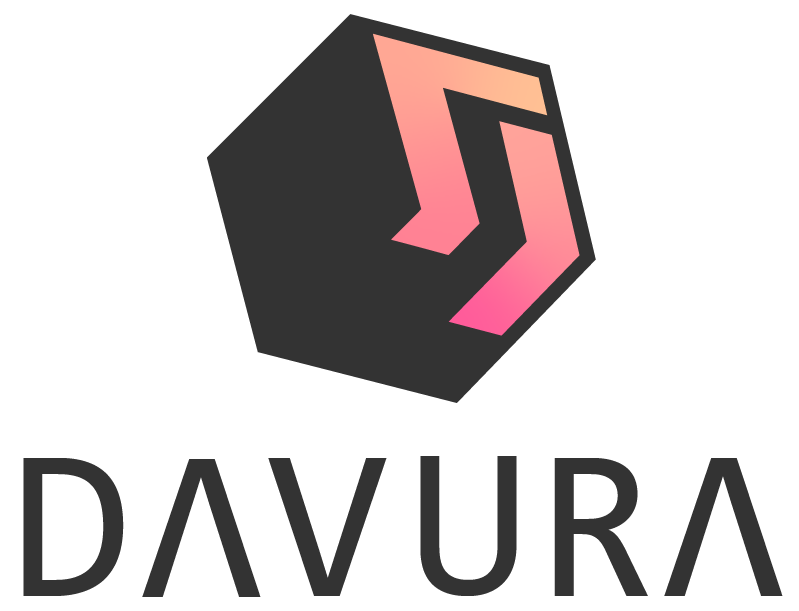

# DΛVURΛ  

    

### This is the code compiled from the documentation of davura made with it. You can check the source code at the following link:

[https://github.com/davura/davura.github.com/tree/source/](https://github.com/davura/davura.github.com/tree/source/)

 

### You can see the documentation in the following link

## [https://davura.github.io/](https://davura.github.io/)